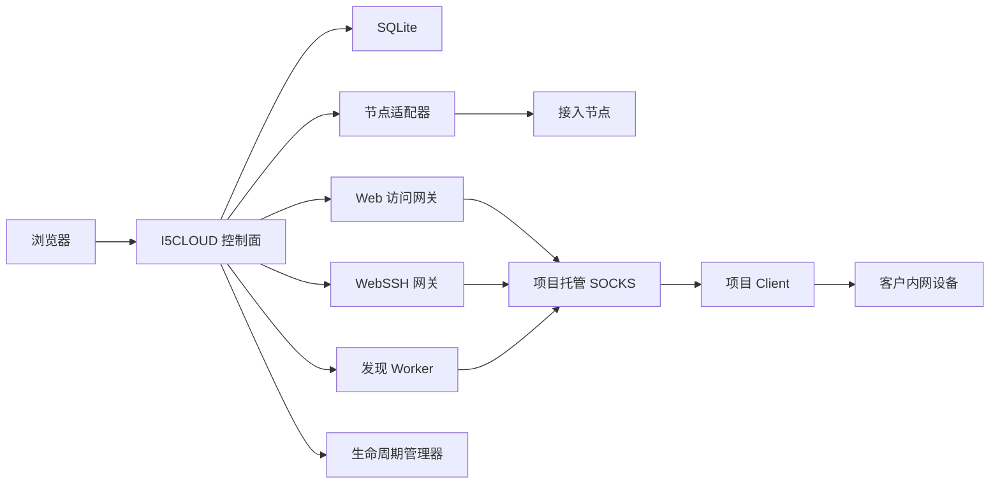

# 系统架构

## 运行结构

V1 是 Go 单进程分层系统。React/TypeScript SPA 编译后嵌入二进制；API、Web 网关、WebSSH、发现 Worker、生命周期管理和 SQLite Store 在同一进程中运行。生产容器不需要 Node.js。

主要组件：

- API：认证、授权、资源 CRUD、状态编排、备份和审计。
- Store：SQLite 迁移、事务、依赖检查和查询。
- 节点适配器：吸收外部接口差异，对业务层提供稳定 DTO。
- Web 网关：短期会话校验、SOCKS 路由、请求头隔离、重定向/Cookie/路径兼容。
- WebSSH：WebSocket、凭据解析、主机密钥校验、SSH 会话和实时撤销。
- 发现：项目扫描 CIDR、并发与端口限制、协议证据、取消和结果确认。
- 生命周期：到期会话、转发和按需通道的回收。
- UI：根据后端权限和真实状态呈现管理平台与访问门户。

## 数据流

- Web：浏览器 → 会话子域名或路径 → Web 网关 → SOCKS → HTTP(S) Endpoint。
- WebSSH：浏览器 WebSocket → WebSSH 网关 → SOCKS → SSH Endpoint。
- 发现：Worker → SOCKS → 项目扫描 CIDR 的指定端口 → 协议证据 → 管理员确认导入。
- 原生服务：外部客户端 → 节点端口转发 → Client → 设备端口。
- 配置：管理员提交 → 完整校验 → 原子写入覆盖配置/Secret → 审计 → 重启生效。
- 认证：密码 → 首次登录或 MFA 挑战 → 正式会话。

## 信任边界

- 控制面登录 Cookie、API 令牌和 CSRF 头不得传给客户设备。
- 客户设备 Cookie 在路径模式限制于短期会话前缀，在 wildcard 模式限制于短期会话子域名。
- wildcard 路由标记只能由服务端上下文写入，客户端请求头不能关闭路径隔离。
- 项目 CIDR 只在创建发现任务时校验；手工登记设备及其访问、转发不应被它拒绝。
- 服务端凭据在请求期间解密或读取，用后清除，不进入 API 响应、URL 或审计正文。
